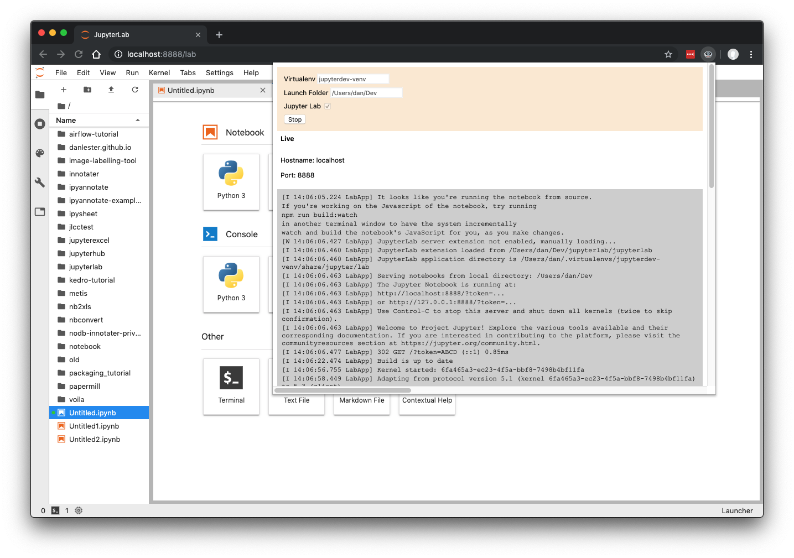
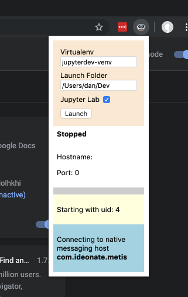

# Metis: Jupyter controller as a Chrome Extension

Start up Jupyter Lab or Notebook instances directly from Chrome into the current tab. Logs and stop button are available within the browser.

You no longer need to switch back and forth between terminal and browser - do everything from Chrome!

Experimental - please try out if you enjoy tinkering. Tested on MacOS, should work on Linux, needs further development for Windows.

You can specify whether you want to start in Jupyter Lab or the standard Notebook format.

Specify the root folder for the Jupyter instance.

Optionally supports virtualenvs through [Virtualenv Wrapper](https://virtualenvwrapper.readthedocs.io/en/latest/index.html).

Expects Jupyter notebook/lab to already be installed globally or in the virtualenv.

## Installation

Metis uses Chrome's [native messaging](https://developer.chrome.com/extensions/nativeMessaging) functionality so requires both a host (Python3 server) and the client (Chrome extension) to be installed.

First step is to clone this repo onto your hard drive somewhere:

`git clone https://github.com/ideonate/metis`

### Host installation

Run metis/controller/install_host.sh from the terminal.

### Chrome Extension installation

In Chrome, go to [chrome://extensions/](chrome://extensions/)

Click the button to enter __Developer Mode__ if not already selected.

Click __Load unpacked__ and locate the metis/chrome folder. Click __Select__.

## Usage

In a new browser tab (or one you are happy to lose) click the Metis icon:

Enter a Virtualenv name or leave blank to run Jupyter globally. If using a Virtualenv name, this should be the [Virtualenv Wrapper](https://virtualenvwrapper.readthedocs.io/en/latest/index.html) name (i.e. the name you would use with the `workon` command).

Enter the full path of the desired root folder for the Jupyter file tree.

Deselect the Jupyter Lab checkbox if you want the old-style notebook interface only (note Jupyter Lab must of course be installed for this to work: `pip install jupyterlab`).

Click __Launch__. The Jupyter server should be started, and the tab reloaded to display the UI at the correct URL.

Click the Metis icon again if you want to view Jupyter logs or to click the __Stop__ button.

Once stopped, you can click __Launch__ again to start a completely new Jupyter instance, possibly on a different port.

## Caveats

Please note that Metis is experimental at this stage. I am happy to receive reports of problems and other feedback, but please don't be disappointed if it doesn't work easily for you.

There may be complications due to the environment in which Chrome is running. To debug, you can run Chrome with logging from the terminal:

`/Applications/Google\ Chrome.app/Contents/MacOS/Google\ Chrome --enable-logging --v=1`

However, by running from the terminal you may change the environment (e.g. env variables) compared to normal running of Chrome!

To uninstall, remove the Chrome extensions from the extensions page and run the metis/controller/uninstall_host.sh script to remove the host.

## Contact

Please get in touch with any feedback or questions: [dan@ideonate.com](mailto:dan@ideonate.com).

## Acknowlegements

Chrome Native Messaging components are based on [Chrome examples](https://chromium.googlesource.com/chromium/src/+/master/chrome/common/extensions/docs/examples/api/nativeMessaging).

Icon from [iconfinder](https://www.iconfinder.com/icons/56191/drive_server_icon) licensed under CC.

## License

This code is released under an MIT license.

